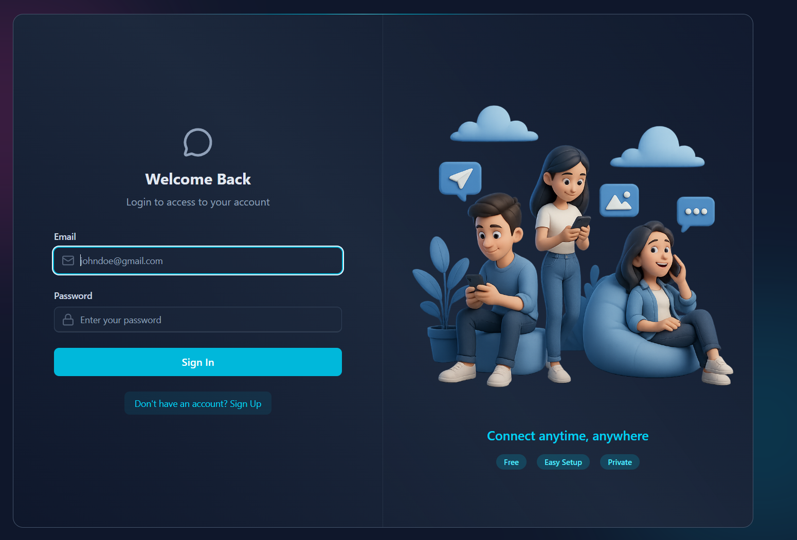
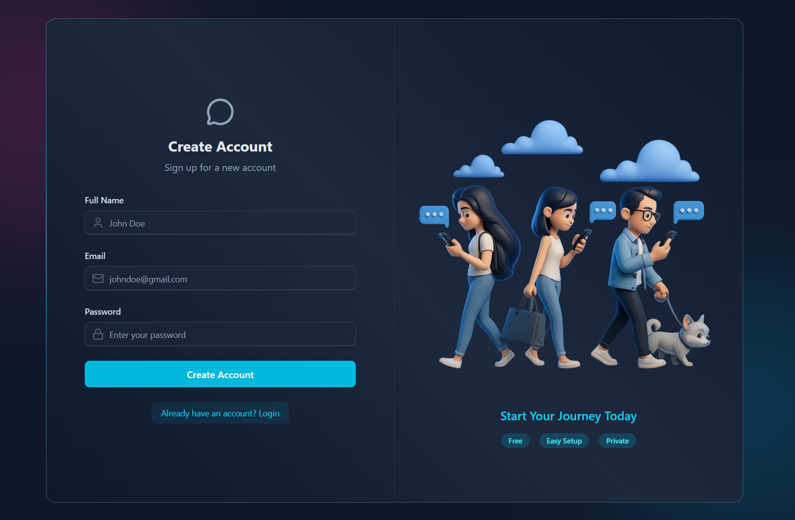
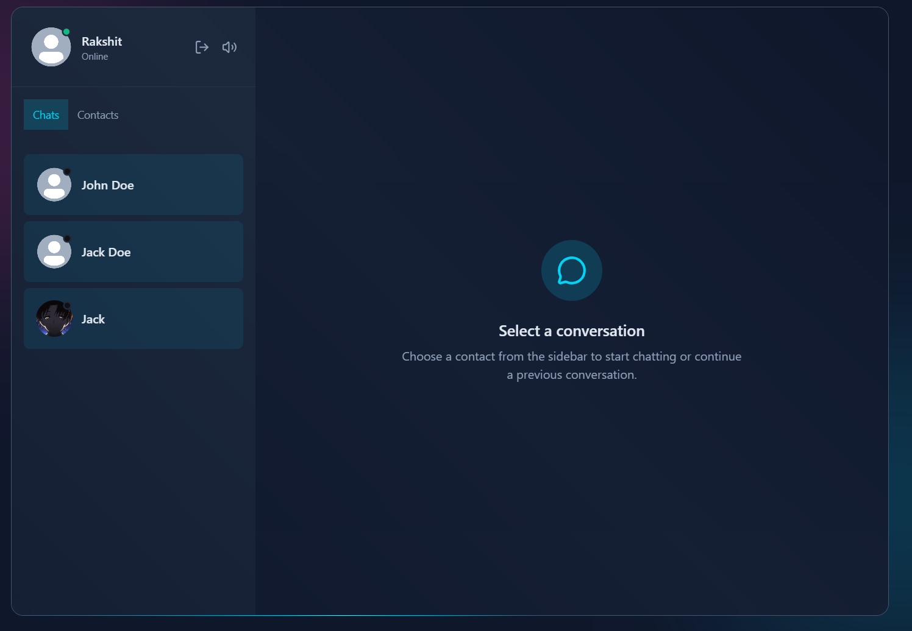
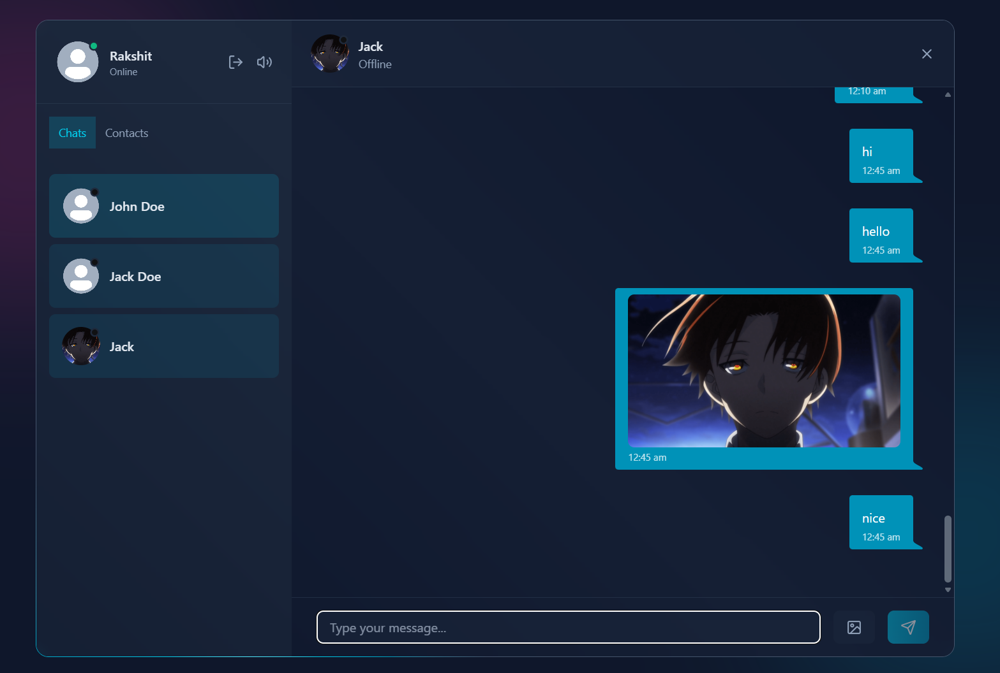

<div align="center">
  
# 💬 Real-Time Chat Application with AI Chat Bot Integration

A modern, full-stack real-time chat application built with the MERN stack, featuring JWT authentication, Socket.io messaging, and a beautiful user interface.

[]()
[]()
[]()
[]()
[]()
[]()

🌐 **Live Demo:** [https://chat-app-y5rr.onrender.com/login](https://chat-app-y5rr.onrender.com/login)

</div>

---

## 📋 Table of Contents
- [📸 Screenshots](#-screenshots)
- [✨ Features](#-features)
- [🛠️ Tech Stack](#️-tech-stack)
- [🚀 Getting Started](#-getting-started)
- [📁 Project Structure](#-project-structure)
- [🔑 Key Features Breakdown](#-key-features-breakdown)
- [🌐 Deployment](#-deployment)
- [🤝 Contributing](#-contributing)
- [📝 License](#-license)
- [👨‍💻 Author](#-author)

---

## 📸 Screenshots

<div align="center">

### Authentication Pages
 &nbsp; 

### Chat Interface
 &nbsp; 

*Beautiful, modern UI with real-time messaging and image sharing capabilities*

</div>

---

## ✨ Features

### 🔐 Authentication & Security
- **Custom JWT Authentication** - Secure user authentication without relying on third-party services
- **Protected Routes** - Authorization middleware to secure API endpoints
- **Password Hashing** - Bcrypt implementation for secure password storage

### 💬 Real-Time Communication
- **Instant Messaging** - Real-time chat powered by Socket.io
- **Online/Offline Status** - Live presence indicators showing user availability
- **Typing Indicators** - Real-time typing status updates
- **Sound Notifications** - Customizable notification and typing sounds with toggle controls

### 🎨 User Experience
- **Modern UI Design** - Beautiful, responsive interface built with React and Tailwind CSS
- **DaisyUI Components** - Pre-styled, accessible UI components
- **Image Sharing** - Upload and share images via Cloudinary integration
- **Welcome Emails** - Automated welcome emails on user registration using Resend

### ⚙️ Technical Features
- **RESTful API** - Well-structured API built with Node.js and Express
- **MongoDB Integration** - Robust data persistence with MongoDB
- **State Management** - Efficient client-side state handling with Zustand
- **Rate Limiting** - API protection powered by Arcjet
- **Professional Git Workflow** - Proper branching, pull requests, and merge strategies

---

## 🛠️ Tech Stack

<div align="center">

| Frontend | Backend | Services & Tools |
| :---: | :---: | :---: |
| React | Node.js | Cloudinary |
| Tailwind CSS | Express.js | Resend |
| DaisyUI | Socket.io | Arcjet |
| Zustand | MongoDB | JWT |
| Socket.io Client | Mongoose | Bcrypt |

</div>

---

## 🚀 Getting Started

### Prerequisites
Make sure you have the following installed on your machine:
- Node.js (v14 or higher)
- MongoDB (local or Atlas)
- npm or yarn package manager

### Installation

1. **Clone the repository**
   ```bash
   git clone https://github.com/RakshitKaintura/CHAT_APP.git
   cd CHAT_APP
   ```

2. **Install dependencies**
   ```bash
   # Install backend dependencies
   npm install

   # Install frontend dependencies
   cd frontend
   npm install
   ```

3. **Environment Variables**
   
   Create a `.env` file in the root directory and add the following variables:

   | Variable | Description |
   | :--- | :--- |
   | `PORT` | Server port (default: 5000) |
   | `NODE_ENV` | `development` or `production` |
   | `MONGODB_URI` | Your MongoDB connection string |
   | `JWT_SECRET` | Your JWT secret key |
   | `CLOUDINARY_CLOUD_NAME` | Cloudinary cloud name |
   | `CLOUDINARY_API_KEY` | Cloudinary API key |
   | `CLOUDINARY_API_SECRET` | Cloudinary API secret |
   | `RESEND_API_KEY` | Resend API key |
   | `ARCJET_KEY` | Arcjet key |

4. **Run the application**
   ```bash
   # Run backend (from root directory)
   npm run dev

   # Run frontend (from frontend directory)
   cd frontend
   npm run dev
   ```

5. **Access the application**
   - Frontend: `http://localhost:5173`
   - Backend: `http://localhost:5000`

---

## 📁 Project Structure
```text
CHAT_APP/
├── frontend/              # Frontend React application
│   ├── src/
│   │   ├── components/    # React components
│   │   ├── pages/         # Page components
│   │   ├── store/         # Zustand store
│   │   ├── utils/         # Utility functions
│   │   └── App.jsx        # Main app component
│   ├── public/            # Static assets & screenshots
│   └── package.json
├── backend/               # Backend application
│   ├── controllers/       # Route controllers
│   ├── models/            # Database models
│   ├── routes/            # API routes
│   ├── middleware/        # Custom middleware
│   ├── socket/            # Socket.io handlers
│   └── server.js          # Server entry point
├── .env                   # Environment variables
└── package.json
```

---

## 🔑 Key Features Breakdown

### 📡 Real-Time Messaging
The application uses Socket.io to establish bidirectional communication between clients and the server, enabling instant message delivery without polling.

### 🔐 Authentication Flow
1. User registers with email and password
2. Password is hashed using bcrypt
3. JWT token is generated and sent to client
4. Token is stored and used for authenticated requests
5. Middleware validates token on protected routes

### 🖼️ Image Upload Process
1. User selects an image
2. Image is uploaded to Cloudinary
3. Cloudinary returns secure URL
4. URL is stored in MongoDB
5. Image is displayed in chat interface

### 🟢 Presence System
- Socket.io tracks connected users
- Online status is broadcasted to all clients
- Disconnection events update user status
- Real-time UI updates reflect changes

---

## 🌐 Deployment

The application is deployed on Render's free tier. To deploy your own instance:

1. **Push to GitHub**
   ```bash
   git add .
   git commit -m "Ready for deployment"
   git push origin main
   ```

2. **Deploy on Render**
   - Create a new Web Service
   - Connect your GitHub repository
   - Set environment variables
   - Deploy!

---

## 🤝 Contributing

Contributions are welcome! Please follow these steps:

1. Fork the repository
2. Create a feature branch (`git checkout -b feature/AmazingFeature`)
3. Commit your changes (`git commit -m 'Add some AmazingFeature'`)
4. Push to the branch (`git push origin feature/AmazingFeature`)
5. Open a Pull Request

---

## 📝 License

This project is licensed under the MIT License - see the [LICENSE](LICENSE) file for details.

---

## 👨‍💻 Author

**Rakshit Kaintura**
- GitHub: [@RakshitKaintura](https://github.com/RakshitKaintura)
- LinkedIn: [Your LinkedIn (Add here)](https://linkedin.com/in/yourprofile)
- Portfolio: [your-portfolio.com (Add here)](https://your-portfolio.com)

---

## 🙏 Acknowledgments

- [Socket.io](https://socket.io/) for real-time communication
- [Cloudinary](https://cloudinary.com/) for image hosting
- [Resend](https://resend.com/) for email services
- [Arcjet](https://arcjet.com/) for security solutions
- The amazing open-source community

---

## 📧 Contact

For questions or feedback, please reach out at [your.email@example.com](mailto:your.email@example.com)

---

<div align="center">
  <strong>⭐ Star this repository if you found it helpful!</strong>
</div>
